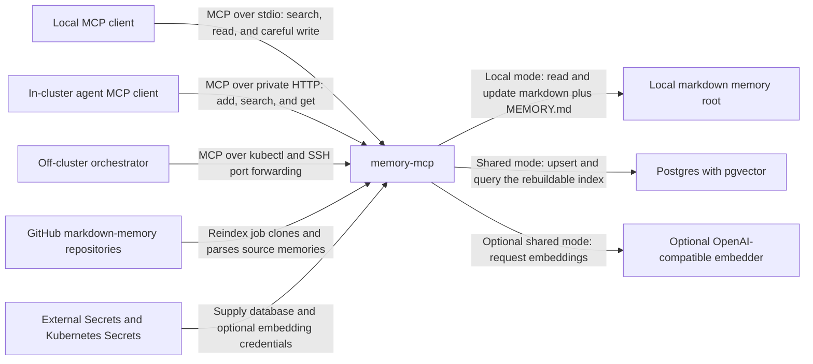

# System context

`memory-mcp` exposes memory through two runtime modes. The local stdio server
reads and carefully updates a markdown memory root. The shared in-cluster HTTP
server reads and writes a rebuildable Postgres/pgvector index populated from
markdown-in-git sources. The modes share Python domain logic but use different
storage backends.

The shared service has no public ingress. Its Helm chart restricts access with
Kubernetes `NetworkPolicy`; off-cluster access uses the documented private
port-forward path. The default embedder is the in-process hashing implementation,
so the external embedding edge exists only when the optional OpenAI-compatible
adapter is configured.

Sources of truth: [`src/memory_mcp/`](../../src/memory_mcp/),
[`templates/`](../../templates/), [`values.yaml`](../../values.yaml), and
[`docs/shared-semantic-memory.md`](../shared-semantic-memory.md).
